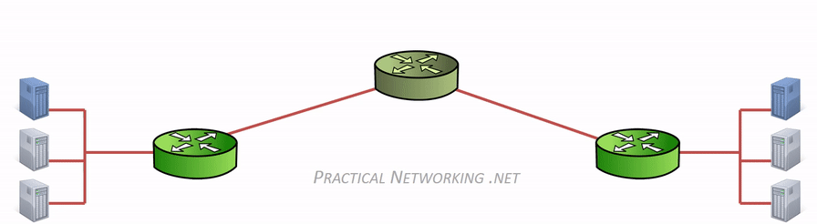
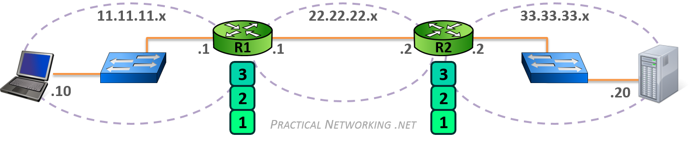
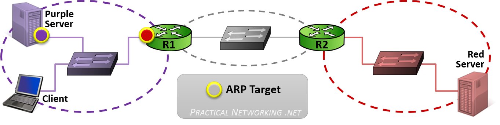
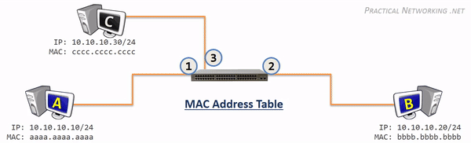

NAT vs Direct Server return 

client -- SLB -- Server

source ip/target ip
1.10.1.11/9.0.0.1 

once request reaches SLB, SLB changes target ip to real server ip 
1.10.1.11/172.12.1.1

real server handles request and return data to SLB via default router 
172.12.1.1/1.10.1.11

slb changes source ip to vip.
9.0.0.1/1.10.1.11

with direct server return. response data won't be handled by SLB. to achieve this, the same vip is configured on both SLB server and real server(s). as the same MAC can't be bind to more than one IPs, special lookback address
172.0.0.1 is utilised to caryy the same vip.

in this  case. data flow like below.
client -- SLB -- Server

source ip/target ip
1.10.1.11/9.0.0.1/mac address 00:00...abc

once request reaches SLB, SLB changes mac address to real server's mac address on layer 2. 
1.10.1.11/9.0.0.1/mac address 00:00...def
real server handles request and return data to client directly without using slb.
172.12.1.1/1.10.1.11

At layer 2, load balancing can distribute traffic among the machines on the same network. But, as we discussed,
it only routes traffic based on MAC addresses. 
It’s impossible to route traffic to another device on a different network using L2 load balancing.
There are many scenarios when this kind of load balancing is helpful. 
One such use case divides the bandwidth equally to all devices within the network.

In contrast, L3 load balancers operate at a higher level, making it possible to route traffic using IPv4 and IPv6
addresses. Organizations use them to distribute the load across different virtual machines. 
They ensure high availability and reliability by circulating requests among servers or VMs.

In contrast to L2 and L3 load balancers, L7 load balancers are software that operates at the application layer. Popular L7 load balancing tools include Nginx and HAProxy. Many of them are open source, making it easy to add SSL termination and implement new protocols like HTTP/3.

L7 load balancers can also use extra information available at the application layer to carry out complex and intelligent load balancing. They can read the content of incoming HTTP(S) and use that data to route the request directly to where it needs to go. Most L7 load balancers also can define rules and targets to achieve the expected routing.

The main disadvantage of L7 load balancers is that they usually act as proxies, 
so they must maintain two open connections: one to the machine that made the request and one to the target machine
that is serving the request. L2 and L3 load balancers, in comparison, simply forward packets to their destination.

Notice between each Router, the MAC address header is stripped and regenerated to get it to the next hop. The IP header generated by the first computer is only stripped off by the final computer, hence the IP header handled the “end to end” delivery, and each of the four different MAC headers involved in this animation handled the “hop to hop” delivery.

OSI Layer 4 – Transport
The Transport layer of the OSI model is responsible for distinguishing network streams.

At any given time on a user’s computer there might be an Internet browser open, while music is being streamed, while a messenger or chat app is running. Each of these applications are sending and receiving data from the Internet, and all that data is arriving in the form of 1’s and 0’s on to that computer’s NIC.

Something has to exist in order to distinguish which 1’s and 0’s belong to the messenger or the browser or the streaming music. That “something” is Layer 4:

Layer 4 accomplishes this by using an addressing scheme known as Port Numbers.

Specifically, two methods of distinguishing network streams exist. They are known as the Transmission Control Protocol (TCP), or the User Datagram Protocol (UDP).

Both TCP and UDP have 65,536 port numbers (each), and a unique application stream is identified by both a Source and Destination port (in combination with their Source and Destination IP address).

TCP and UDP employ different strategies in how data streams are transferred, and their distinction and inner workings are both fascinating and significant, but unfortunately they are outside the scope of this article series. They will be the topic of a future article or series.

To summarize, 
if Layer 2 is responsible for hop to hop delivery,
and Layer 3 is responsible for end to end delivery, 
it can be said that Layer 4 is responsible for service to service delivery.

Layer 4 will add a TCP header which would include a Source and Destination port
Layer 3 will add an IP header which would include a Source and Destination IP address
Layer 2 would add an Ethernet header which would include a Source and Destination MAC address

#### host
The term host is a generic term that implies any sort of end-device on the Internet. Any device which might be the original initiation of traffic or the final destination of traffic can be considered a host.

#### network
A Network is simply two or more connected devices — typically grouped together by similar purposes or physical location. A network can take many different forms, for example:

#### switch
A Switch is a network device whose primary purpose is to facilitate communication within networks.Switches operate at Layer 2 of the OSI model, which means they only look into each data-gram up to the Layer 2 header. The Layer 2 header contains information that enables hop to hop delivery, such as the Source and Destination MAC address.

A Switch operates by maintaining what is known as a MAC Address table. This is a table that maps MAC addresses of devices plugged into each switch port. A typical switch has many ports, from 24 to 48, up to 96, or more.

The MAC Address Table is populated by looking at the Source MAC address field of any received frames.

In order to forward the frame, the Switch will lookup the Destination MAC address in their MAC Address Table to determine what port to use.

If a Switch encounters a frame for which it does not know the location of the Destination MAC address, it simply duplicates and floods the frame out each switch port (except the port it was received on). This process will be examined more closely in another article in this series.

#### Router
A Router is a network device whose primary purpose is to facilitate communication between networks. Each interface on a router creates a network boundary.

Routers operate at Layer 3 of the OSI Model, which means they only look into each datagram up to the Layer 3 header. The Layer 3 header contains information that enables end to end delivery, such as the Source and Destination IP Address.

In the image above, notice that the router on the left (R1) and the router on the right (R2) create three separate networks (11.11.11.x, 22.22.22.x, and 33.33.33.x). R1’s right interface and R2’s left interface are both on the same network.

The only way for the Client in the 11.11.11.x network to speak to the Server in the 33.33.33.x network is to forward the packet to R1, who will in turn forward the packet to R2, who will then finally forward the packet to the Server.

A Router accomplishes all this by maintaining what is known as a Routing Table. This is a table that contains paths to all the networks a Router knows how to reach. These paths are sometimes known as Routes, and each entry contains an IP Network and either an interface or the IP address of the next router in the path to the target.

Keep in mind, from the perspective of each router, the Route Table is a map of every network that exists. If a router receives a packet destined to a network it does not know about, then as far as that router is concerned, that network must not exist. Therefore, when a router receives a packet destined to a network which is not in its Routing Table, that packet is discarded.

### Address Resolution Protocol (ARP)

 MAC addresses are a Layer 2 addressing scheme. We also discussed that IP addresses are a Layer 3 addressing scheme. What bridges these two addressing schemes is the Address Resolution Protocol (ARP).
 Typically, when two hosts are communicating, they already know each other’s IP address. They can know each other’s IP address from a variety of methods: sometimes it is manually provided by a user, sometimes by another protocol (often DNS). But the actual method employed is irrelevant (at least to this article series).
 However, what is definitely not known is their MAC addresses. The hosts will use ARP to discover the appropriate MAC address. To put it another way, ARP will use the known IP address, and discover the unknown MAC address. The discovered mapping is then added and stored in an ARP Table, which is a mapping of IP addresses to correlating MAC addresses.

We’ll describe how L2 and L3 are bridged together, and ARP’s role in the process using the following illustration:

In the image above, there are three networks: the purple network, the gray network, and the red network. We’ll use this diagram to illustrate two instances of ARP: First when a host is speaking to another host in the same network (Client to Purple server). And Second when a host is speaking to another host in a different network (Client to Red server).

When the Client needs to speak to the Purple Server, it will know the Purple Server’s IP address, and from that it will determine that the Purple Server exists in the local network. When a Client is attempting to speak to a host in the same network, the Client will issue an ARP request for the host’s MAC address.

ARP will allow the Client to complete the Layer 2 header as follows:

When the Client needs to speak to the Red Server, it will know the Red Server’s IP address, and from that it will know that the Red Server exists in a foreign network. As such, the packet must be delivered to the nearest router — otherwise known as the Default Gateway.

The Client is generally already configured with a Default Gateway — which we can tell from the image will be the R1. When a Client is attempting to speak to a host in a foreign network, the Client will issue an ARP request for the Default Gateway’s MAC address.

This will allow the Client to populate the Layer 3 and Layer 2 headers as follows:

To summarize ARP’s operation:

When a Client is speaking to a host in the same network, it will ARP for the MAC address of the host
When a Client is speaking to a host in a different network, it will ARP for the MAC address of the Default Gateway
Remember, packet delivery is always the job of Layer 2, and Layer 2’s primary goal is getting a packet from hop to hop. Conversely, Layer 3, which is concerned with end to end delivery is unable to put a packet on a wire and send it to another host’s NIC. ARP’s role is to help the client create the proper L2 header, based on the L3 header, in order to get the packet from one hop to the next.

It should also be noted that any device that intends to forward a packet based upon the IP address (L3), must also have the ability to deliver the packet to the next hop (L2). As such, any device that uses IP addresses must also use ARP to deliver the packet using MAC addresses. Consequently, all Layer 3 devices must maintain an ARP Table.

A [arp explained](https://www.practicalnetworking.net/series/arp/arp-in-5-minutes/)

OSI Layer 1 is the physical medium carrying the 1’s and 0’s across the wire
OSI Layer 2 is responsible for hop to hop delivery and uses MAC addresses
OSI Layer 3 is responsible for end to end delivery and uses IP Addresses
OSI Layer 4 is responsible for service to service delivery and uses Port Numbers
We also discussed some of the Key Players involved in moving a packet through the Internet:

Switches facilitate communications within networks and operate at Layer 2
Routers facilitate communication between networks and operate at Layer 3
ARP uses a known IP address to resolve an unknown MAC address
We also discussed three different tables that are use to store different mappings:

Switches use a MAC Address Table which is a mapping of Switchports to connected MAC addresses
Routers use a Routing Table which is a mapping of known Networks to interfaces or next-hop addresses
All L3 devices use an ARP Table which is a mapping of IP Addresses to MAC addresses

ARP Request is sent as a Broadcast, and had there been other hosts connected to this link, they too would have received the ARP Request.

Also note that Host A includes its own MAC address in the ARP Request itself. This allows Host B (if it exists) to easily respond directly back to Host A with the requested information.

Receiving the ARP Request allows Host B to learn something. Namely, that Host A’s IP address is 10.10.10.10 and the correlating MAC address is aaaa.aaaa.aaaa. Notice this entry is now added to Host B’s ARP Table.

Host B can use this new information to respond directly to Host A. The ARP Response is sent as a Unicast message, directly addressed to Host A. Had there been other hosts on this link, they would not have seen the ARP Response.

The ARP Response will include the information Host A requested: The IP Address 10.10.10.20 is being served by the NIC with the MAC address bbbb.bbbb.bbbb. Host A will use this information to populate its ARP Table:

#### host to host through a router

Router Functions
Earlier we mentioned that a Router’s primary purpose is to facilitate communication between networks. As such, every router creates a boundary between two networks, and their main role is to forward packets from one network to the next.

Notice in the image above, we have R1 creating a boundary between the 11.11.11.x network and the 22.22.22.x network. And we have R2 creating a boundary between the 22.22.22.x and 33.33.33.x networks. Both of the routers have an interface in the 22.22.22.x network.

In order to forward packets between networks, a router must perform two functions: populate and maintain a Routing Table, and populate and maintain an ARP Table.

Populating a Routing Table
From the perspective of each Router, the Routing Table is the map of all networks in existence. The Routing Table starts empty, and is populated as the Router learns of new routes to each network.

There are multiple ways a Router can learn the routes to each network. We will discuss two of them in this section.

The simplest method is what is known as a Directly Connected route. Essentially, when a Router interface is configured with a particular IP address, the Router will know the Network to which it is directly attached.

For example, in the image above, R1’s left interface is configured with the IP address 11.11.11.1. This tells R1 the location of the 11.11.11.x network exists out its left interface. In the same way, R1 learns that the 22.22.22.x network is located on its right interface.

Of course, a Router can not be directly connected to every network. Notice in the image above, R1 is not connected to 33.33.33.x, but it is very likely it might have to one day forward a packet to that network. Therefore, there must exist another way of learning networks, beyond simply what the router is directly connected to.

That other way is known as a Static Route. A Static Route is a route which is manually configured by an administrator. It would be as if you explicitly told R1 that the 33.33.33.x network exists behind R2, and to get to it, R1 has to send packets to R2’s interface (configured with the IP address 22.22.22.2).

